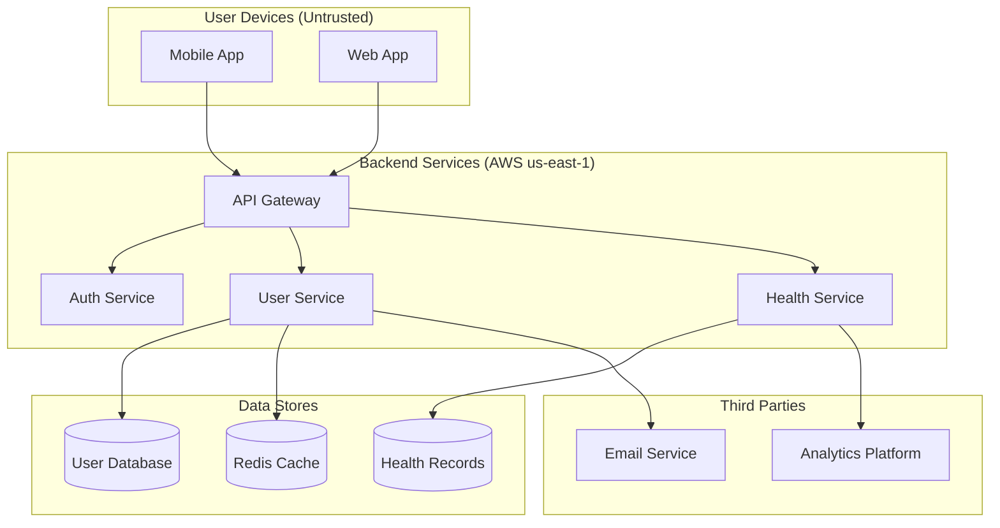

# Health Tracker — Annotated Flowchart Example

This shows a fully annotated PrivGraph diagram and the expected rule evaluation results.

## Architecture

## Expected Rule Evaluation

**Active findings:**

🟡 MEDIUM — PG-009: GDPR Storage Without Retention Policy
- Node: UserDB
- UserDB has GDPR compliance scope but no retention-policy control.
- → Add: `%% @pg:control UserDB retention-policy`

**Suppressed findings (1):**

- PG-003 on Cache — suppressed by risk-accept (session data, 24hr TTL)

**All other rules pass.** The diagram has full encryption in transit for all sensitive flows, encryption at rest for all stores, DPAs for third parties, audit logging for HIPAA-scoped components, and retention policy for the health database.
