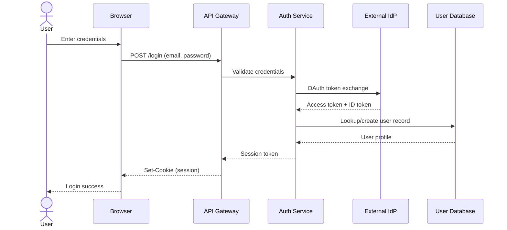

# OAuth Login — Annotated Sequence Diagram Example

## Login Flow

## Expected Rule Evaluation

**Active findings:**

🟡 HIGH — PG-004: Credentials Without Encryption
- Flow: User → Browser
- Credentials entered on user device without documented encryption.
- → This is typically acceptable (local input) — consider a risk-accept:
  `%% @pg:risk-accept User->>Browser PG-004 "Local user input on device, not a network transfer"`

🟡 MEDIUM — PG-009: GDPR Storage Without Retention Policy
- Node: DB
- GDPR-scoped user database lacks retention policy.
- → Add: `%% @pg:control DB retention-policy`

🟡 MEDIUM — PG-003: Missing Retention Policy
- Node: DB
- Stores DIRECT_ID without retention policy.
- → Same fix as above covers this.

**All other rules pass.** Third-party IdP has a DPA, all network flows are encrypted, and audit logging is in place.
